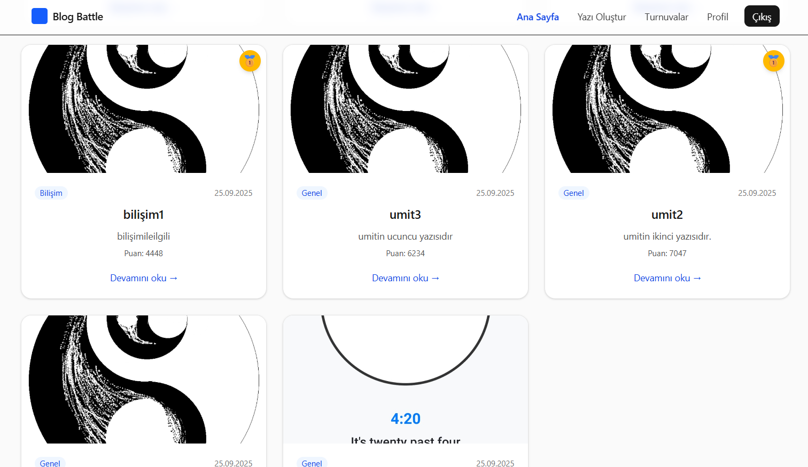
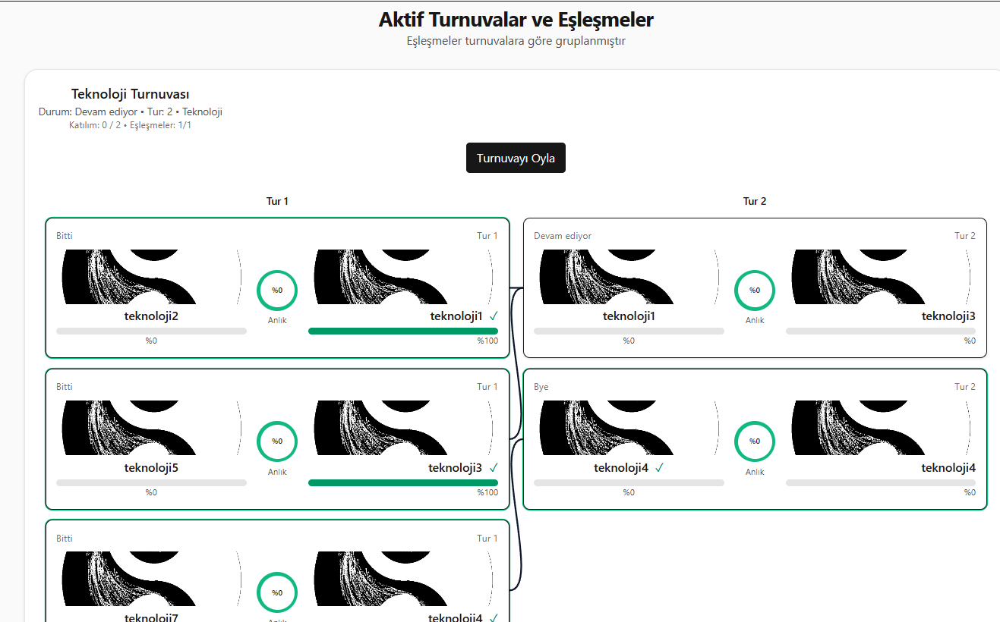
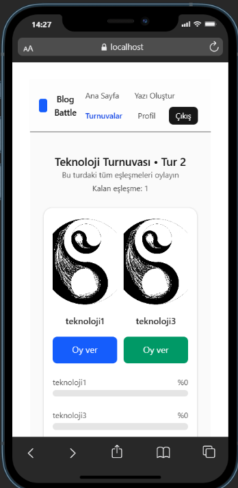
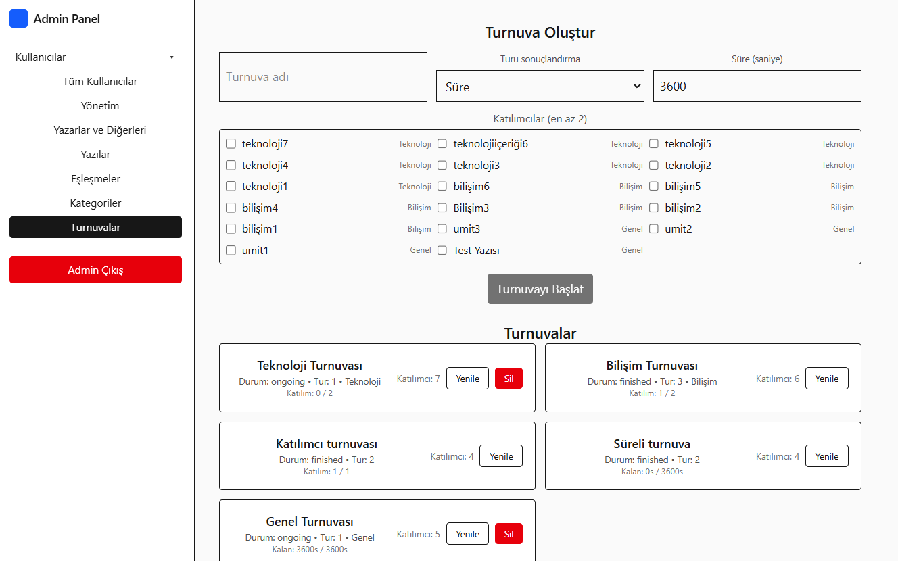
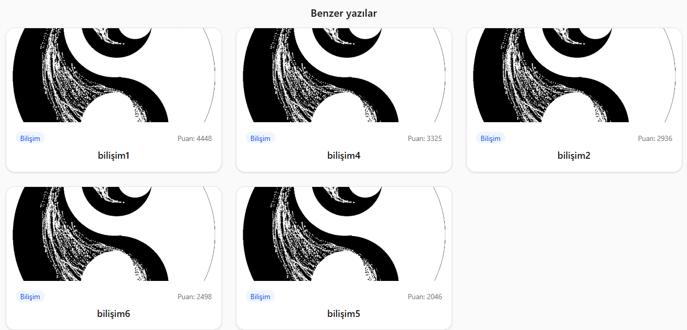
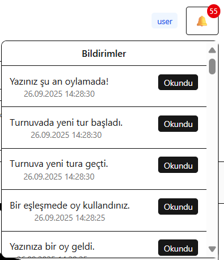
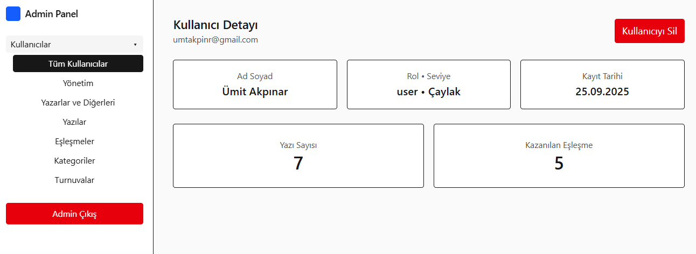
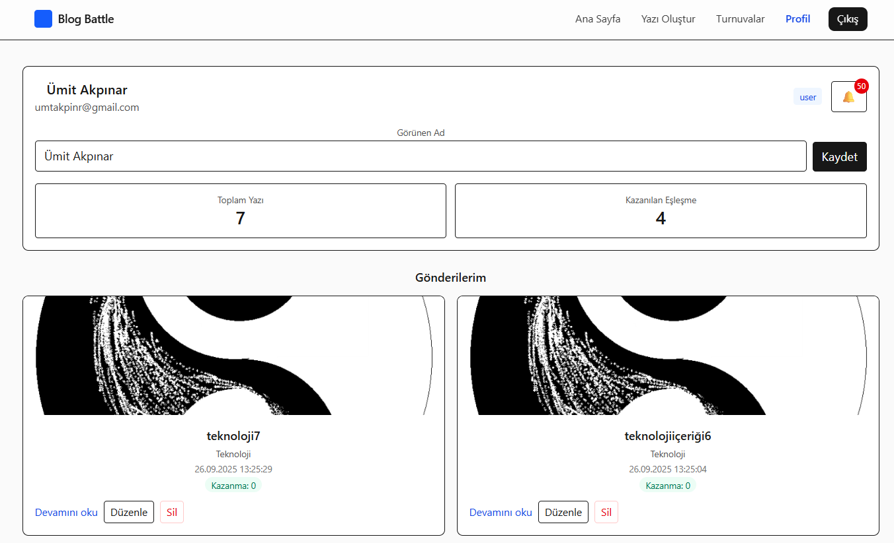

## Blog Battle

Kullanıcıların blog yazıları gönderip ikili eşleşmelerde gerçek zamanlı oyladığı tam yığın (React + Node.js + MongoDB) uygulaması. Turnuva (bracket) sistemi, tur bazlı oylama akışı, katılım/süre eşiğine göre otomatik tur ilerletme, SSE ile anlık güncellemeler ve bağımsız admin panel içerir.

### Özellikler
- Kullanıcı kayıt/giriş (JWT), ayrı admin oturumu
- Yazı oluşturma (başlık, içerik, kategori seçimi zorunlu, görsel yükleme)
- Turnuva sistemi: kategori veya tüm kategoriler, rastgele eşleşme, bye yerine otomatik üst tura geçiş
- Oylama: turnuvayı oyla akışı (tek tek maç değil), tek oy kuralı, 5 sn sonuç gösterimi ve otomatik sonraki maça geçiş
- Otomatik tur ilerleme: süre ya da katılım yüzdesi eşiği; yeni tur başlangıcında bildirim
- Anlık güncellemeler: oy yüzdeleri ve bildirimler SSE ile
- Anasayfa: yazılar + aktif turnuvalar, kazanan yazılarda madalya
- Profil: aktif/bitmiş eşleşmeler, verdiğim oylar, oyladığım turnuvalar, seviye (3 yazı=+1, 1 kazanılmış turnuva=+1)
- Admin panel: kullanıcı/rol/level, yazı, kategori, turnuva (oluştur, ilerlet, yenile, iptal et/sil, sahte oyları sıfırla)
- Modern, Türkçe arayüz; responsive; mobilde swipe + buton alternatifleri

### Öne Çıkan Ekran Görüntüleri
- **Anasayfa ve kazananlar**: Madalya ikonlu kazanan yazılar ve akıcı kart düzeni.



- **Turnuvalar**: Aktif/toplam maç, süre/katılım metrikleri ve oyla butonu.



- **Turnuvayı Oyla (Mobil)**: Swipe rehberi + alt aksiyon butonları, 5 sn sonuç.



- **Admin Yönetimi**: Turnuvayı manuel başlat/ilerlet/yenile/iptal.



### Kurulum
Önkoşul:
- Node.js 18+
- MongoDB Community Server (servis olarak çalışıyor olmalı)

Bağımlılıklar:
```bash
cd apps/server && npm i
cd ../client && npm i
```

### Ortam Değişkenleri
`apps/server/.env` (örnek):
```ini
PORT=5000
MONGODB_URI=mongodb://localhost:27017/blog_battle
 CORS_ORIGIN=http://localhost:5173
UPLOAD_DIR=uploads
JWT_SECRET=change_me
```
`apps/client/.env` (opsiyonel):
```ini
VITE_API_URL=http://localhost:5000
```

### Çalıştırma (Geliştirme)
Backend:
```bash
cd apps/server
npm run dev
```
Frontend:
```bash
cd apps/client
set VITE_API_URL=http://localhost:5000 && npm run dev
# PowerShell alternatifi: $env:VITE_API_URL="http://localhost:5000"; npm run dev
```

### Seed (Örnek Veri)
```bash
cd apps/server
npm run seed
```
- Örnek kullanıcı: `demo@example.com` / `Password123`
- Admin: `admin@example.com` / `Password123`
- 4 yazı ve 2 aktif eşleşme otomatik oluşturulur.

### Test Akışı
1) Kullanıcı girişi: `demo@example.com` / `Password123`
2) Anasayfada yazılar ve Aktif Turnuvalar sayfasında turnuvaları görüntüle
3) Turnuva kartından “Turnuvayı Oyla” → eşleşmeleri sırayla oylayın; her maç sonrası 5 sn sonuç görünür
4) Tur bittiğinde otomatik/manuel yeni tura geçiş; bildirim ziline bildirim düşer
5) Yeni yazı oluştur (başlık/içerik zorunlu, kategori seç, görsel yükle) → ilgili kategori turnuvasının ilk turuna otomatik dahil olur
6) Profil’de aktif/bitmiş eşleşmeler, verdiğim oylar ve oyladığım turnuvaları gör

### API Kısa Rehber (Seçme)
- Auth: `POST /auth/register`, `POST /auth/login`, `GET /auth/me` (kullanıcı), `GET /auth/me/admin` (admin)
- Posts: `GET /posts`, `POST /posts` (form-data, auth), `GET/PUT/DELETE /posts/:id`
- Tournaments: `GET /tournaments`, `GET /tournaments/:id`, `POST /tournaments` (admin), `POST /tournaments/:id/progress` (admin), `POST /tournaments/:id/progress-public` (kamu)
- Matches: `GET /matches/by-post/:postId`, `GET /matches/:id/stream`
- Votes: `POST /votes` { matchId, choice: "A" | "B" } (tek oy kuralı)

### Veritabanı ve Dosyalar
- Veritabanı (MongoDB)
  - CLI: `mongosh "mongodb://127.0.0.1:27017"`
  - GUI: MongoDB Compass
- Yüklenen görseller: `apps/server/uploads` altında saklanır ve `VITE_API_URL` ile servis edilir.
- CLI: `mongosh "mongodb://127.0.0.1:27017"`
- GUI: MongoDB Compass

#### Dump/Restore (Opsiyonel)
Reprodüksiyon için seed önerilir. İstenirse mevcut veritabanını dışa/içe aktarabilirsiniz:

```bash
# Binary dump
mongodump --uri "mongodb://127.0.0.1:27017" -d blog_battle -o dump/

# Geri yükleme (mevcut koleksiyonları temizleyerek)
mongorestore --drop --uri "mongodb://127.0.0.1:27017" dump/blog_battle
```

Alternatif JSON:
```bash
# JSON dışa aktarma
mongoexport --db blog_battle --collection posts --out posts.json

# JSON içe aktarma (koleksiyonu sıfırlayarak)
mongoimport --db blog_battle --collection posts --drop --file posts.json
```

Repo içi JSON dataset (opsiyonel, hızlandırma):
```bash
# export (cihazında mongoexport yüklüyse)
cd apps/server
npm run export:json

# import (db-json klasöründen geri yükleme)
npm run import:json
```

### Sorun Giderme
- 5000 portu dolu → süreç sonlandır veya `PORT` değiştir
- Tailwind/PostCSS → `postcss.config.cjs` ve `@tailwindcss/postcss` doğru kurulu olmalı; Vite cache temizle (`.vite`)
- `mongosh` bulunamadı → tam exe yolu veya PATH ekle; yönetici PowerShell’le servis başlat
- CORS → `CORS_ORIGIN` istemci kök adresiyle eşleşmeli (5173)
- Admin/giriş çakışması → `admin_token` ve `token` farklı storage anahtarlarıdır; interceptor mevcut token’ı ezmez

—
Bu proje mülakat görevi kapsamında geliştirilmiştir. Detaylı teknik günlük ve kararlar için `KNOWLEDGE.md` dosyasına bakınız.

### Gereksinimler → Çözümler (Açıklamalı)

1) Kullanıcı kayıt/giriş (JWT)
- Çözüm: `POST /auth/register`, `POST /auth/login`, `GET /auth/me`; token localStorage’da saklanır. Admin için ayrı `admin_token` anahtarı kullanılır ve `GET /auth/me/admin` ile doğrulama yapılır.

2) Blog oluşturma (başlık, içerik, görsel, kategori)
- Çözüm: `POST /posts` form-data; Zod doğrulama ile `başlık` ve `içerik` zorunlu. Kategori admin tarafından yönetilir; yazar sadece var olan kategorilerden seçer. Görseller `uploads` dizinine kaydedilir ve istemciye `VITE_API_URL + imageUrl` ile servis edilir.

3) Eşleşme mantığı (rastgele/kategori)
- Çözüm: Turnuvalar kategori bazlıdır (veya tüm kategoriler). İlk tur oluşturulurken gönderiler karıştırılıp ikili gruplara ayrılır. Tek kalan olursa “self-match” yapılmaz; katılımcı `byes` listesine eklenir ve direkt üst tura taşınır.

4) Oylama endpoint’i ve tek oy
- Çözüm: `POST /votes` ile { matchId, choice } alınır. Kullanıcı başına aynı maça bir oy sınırı DB düzeyinde kontrol edilir. Oy sonrası SSE ile yüzdeler güncellenir.

5) Bracket (kazanan üst tura)
- Çözüm: Her tur bittikten sonra kazanan postId’ler toplanıp bir sonraki turun maçları oluşturulur. `byes` katılımcıları doğrudan yeni turun katılımcı havuzuna eklenir.

6) Turnuvayı Oyla akışı (tek tek maç yerine akış)
- Çözüm: `TournamentVote.tsx` sırasıyla oylamayı yönlendirir; zaten oy verilmiş/bitmiş maçlarda 5 sn sonuç gösterir ve otomatik geçer. Tüm oylanabilir maçlar bitince kısa bir tebrik modalı ve yönlendirme yapılır.

7) Otomatik tur ilerleme (süre/katılım)
- Çözüm: `progressionMode` = `time` veya `participation`. `time`: `currentRoundStartedAt + threshold` süresi dolunca. `participation`: o turdaki oylanabilir maçların her birinde en az bir oy varsa ve/veya toplam katılım eşiği sağlandıysa. Koşul sağlanınca kalan ongoing maçlar mevcut oy durumuna göre finalize edilip yeni tur oluşturulur.

8) Admin Panel (bağımsız giriş, menü dışı)
- Çözüm: `/admin` layout’u ana menüden ayrıdır, ayrı login sayfası vardır. Admin token’ı `admin_token` olarak saklanır ve kullanıcı token’ı ile karışmaz.

9) Admin → eşleşmeleri manuel başlatma / yönetme
- Çözüm: Admin, kategori seçip turnuva oluşturabilir veya mevcut turnuvayı `Yenile` ile aynı parametrelerle sıfırdan başlatabilir. `İptal Et` turnuvayı tamamen siler. Tur ilerletme için admin uçları vardır (`POST /tournaments/:id/progress`). Kamu oylama akışı için `POST /tournaments/:id/progress-public` eklenmiştir.

10) Bildirimler
- Çözüm: `Notification` modeli; tipler: `match | post | vote | tournament | round | system`. Yeni yazı oluşturulunca yazar haberdar edilir. Yazı eşleşmeye girdiğinde ve turnuva yeni tura geçtiğinde ilgili kullanıcılara bildirim yollanır. İstemci tarafında zil ikonunda listelenir.

11) Benzer içerikler (aynı kategori + etkileşim)
- Çözüm: `engagementScore = views * 1 + interactions * 3` formülü ile her yazının etkileşim skoru hesaplanır. Detay sayfasında aynı kategorideki yazılar, `engagementScore` azalan sırada sıralanarak kart olarak gösterilir (anasayfa kart stiliyle).

12) Seviye sistemi
- Çözüm: 3 yazı başına +1 seviye, 1 kazanılmış turnuva +1 seviye. Örn. 10 yazısı olan biri Çaylak olamaz; seviye hesaplaması backend’de güncellenmiştir. Admin için yeniden hesapla butonu eklenmiştir.

13) Güvenlik ve tekillik
- Çözüm: JWT ile auth; admin guard ve user guard ayrımı; tek oy kuralı DB kontrolü; turnuva içindeki aynı iki post için mükerrer ongoing maçın başlamaması; 304 önleme için cache-busting parametreleri.

14) Mobil UX geliştirmeleri
- Çözüm: Mobilde swipe için görsel rehber ve alternatif sabit buton barı eklendi. Duyarlı grid ve görsel yükseklikleri optimize edildi. “VS” rozeti masaüstünde ortada gösterilir.

15) Anasayfa ve metrikler
- Çözüm: Aktif turnuvalar sayfasına taşındı; anasayfada yazılar + turnuva özetleri. Her turnuva için “bu turdaki toplam ve aktif maç sayısı”, katılım/süre durumları ve kazanan yazılara madalya gösterimi.

16) Otomatik kategori turnuvaları ve yeni yazı ekleme
- Çözüm: Yeni kategori oluşturulurken turnuva otomatik açılır (varsayılan ilerleme modu: participation %50). Kategoriye yeni yazı gelince ilk turda mevcut bye’larla eşleştirme, yoksa serbest yazıyla eşleştirme, hiçbiri yoksa bye olarak ekleme; ardından `resetTournament` ile ilk tur tüm katılımcılarla yeniden başlatılır.

17) Sahte oyları sıfırla
- Çözüm: Admin uçları ile tek maç, tüm turnuva veya tüm sistem oylarını sıfırlama seçenekleri sunulur.

18) Hata ve akış sağlamlığı
- Çözüm: Oylama akışında idempotent zamanlayıcılar (Refs ile), dependency değişimi kaynaklı hook hataları giderildi, 304/önbellek ve çoklu çağrı sorunlarına önlem alındı, sayfa yönlendirmelerinde bekleme ve fallback ekleri yapıldı.

19) Görseller ve dosyalar
- Çözüm: Multer ile upload, yerel dosya sistemi `uploads/`; URL’ler API köküne bağlanır; profil ve listelerde resimler gösterilir; düzenlemede görsel güncelleme hataları giderildi.

### Teslimat ve İnceleme
- Depo: GitHub reposu olarak teslim edilir.
- README: Bu dosya kurulum ve çalıştırma talimatlarını, seed/dump seçeneklerini ve özellikleri içerir.
- Örnek veri: Seed ile en az 4 yazı ve 2 aktif eşleşme otomatik gelir (`npm run seed`).
- Test edilebilir akış: Kullanıcı girişi → turnuvayı oyla → tur ilerleme → bildirim → profil görünümleri.
- UI: Türkçe, modern ve responsive; mobil swipe + buton destekli.

### Hızlı Teslim/PUSH

```bash
# proje kökünde
git init
git add .
git commit -m "feat: Blog Battle final teslim"
git branch -M main
git remote add origin https://github.com/umitakpinarumit/blog-battle.git
git push -u origin main
```

Reviewer için hızlı kurulum:
```bash
# backend
cd apps/server
cp .env.example .env
npm i
npm run seed
npm run dev

# yeni terminal
cd ../client
cp .env.example .env
npm i
npm run dev
```

### Ekran Görüntüleri
Anasayfa, turnuva akışı, bildirimler ve mobil swipe deneyiminden bazı kareler:








